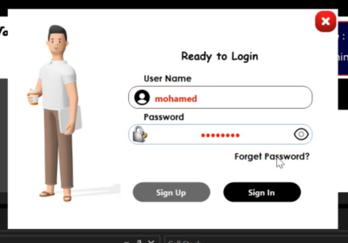
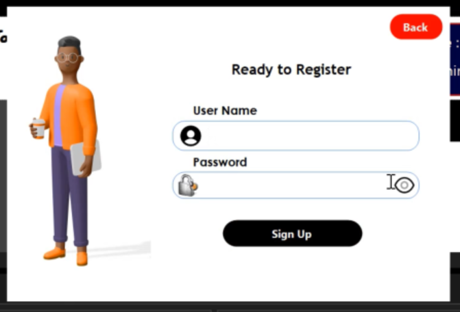
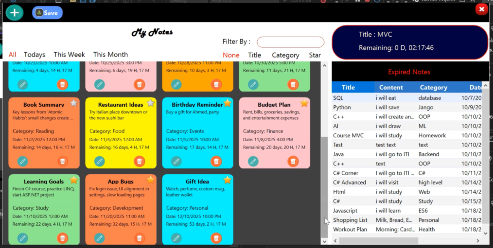
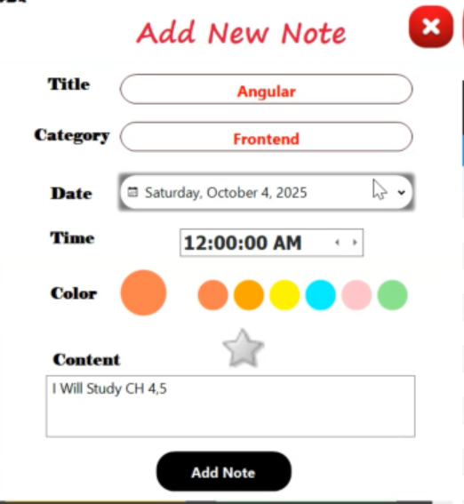
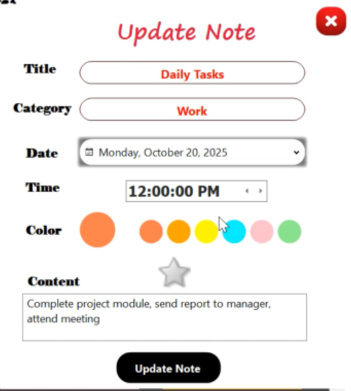
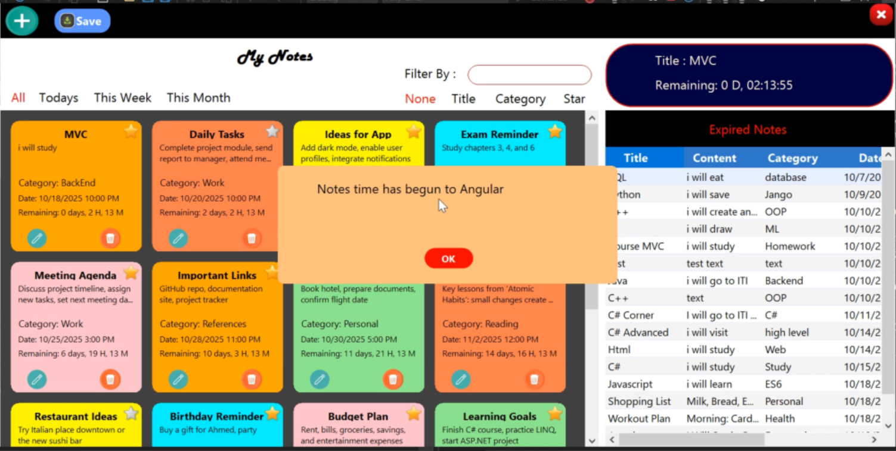

# Digital Notes Manager

Digital Notes Manager is a professional Windows Forms application for creating, organizing and managing personal notes. It is designed for productivity: fast note creation, flexible organization, user authentication, and persistent storage using EF Core migrations. This README describes the project, folder structure, how to run it, and includes a project walkthrough video and annotated screenshots.

**Key Features:**

- **Create, Edit & Delete Notes:** Rich editor window for note title and body, with save/load support.
- **User Accounts:** Register and Login screens to keep user notes separate.
- **Organization:** Categories/tags and a note list for quick navigation and filtering.
- **Multi-window UI:** MDI-style interface to work with multiple notes concurrently.
- **Persistence:** Entity Framework Core migrations and a local database for reliable storage.
- **Localization & Resources:** Contains localized resources and bundled fonts/images.

**Project Structure (high-level):**

- `Notes/` : Main Visual Studio project folder containing source code and resources.
	- `Program.cs` : Application entry point.
	- `Models/` : `Notes.cs`, `Users.cs`, and `NotesDBContext.cs` (EF Core models and context).
	- `Screens/` : Windows Forms screens (login, register, main page, add/update note forms).
	- `Resources/` : Icons and image assets used by the UI.
	- `dialog/` : Reusable dialog components (confirm, message dialogs).
	- `Migrations/` : EF Core migrations for database schema.

**Requirements**

- .NET 8.0 SDK (Windows)
- Visual Studio 2022/2023 (recommended) or `dotnet` CLI

**Build & Run (quick)**

1. Open the solution `Notes/Notes.sln` in Visual Studio and build, or use the CLI:

```bash
dotnet build Notes/Notes.csproj
dotnet run --project Notes/Notes.csproj
```

2. The application runs as a Windows desktop app; use the provided login or register to begin creating notes.

**Project Video (Download Only)**

The walkthrough video is available as a downloadable file — GitHub does not reliably play videos inline. Please download the file and play it locally.

- Download the video: [RunProject.mp4](RunProject.mp4)

**Screenshots (displayed & download links)**

Below are detailed screenshots showing the major screens and workflows of the Digital Notes Manager application.

---

**1. Login Screen**



**Description:** The entry point for existing users. Users enter their registered email and password to access their account and view their saved notes.

- Download: [Screenshot-login.png](Screenshot-login.png)

---

**2. Register Screen**



**Description:** New user registration form. Collects user details (name, email, password) to create a new account in the system. Password validation and duplicate email checks are enforced.

- Download: [Screenshot-register.png](Screenshot-register.png)

---

**3. Main Application Screen**



**Description:** The primary dashboard after login. Displays a list of all user's notes with options to search, filter, and sort. Users can select a note to view, edit, or delete it. This is the hub for note navigation and organization.

- Download: [Screenshot-main.png](Screenshot-main.png)

---

**4. Add New Note Screen**



**Description:** Form to create a new note. Includes fields for note title, note body/content, and category/tag selection. Users can set priority, add a detailed description, and save the note to the database.

- Download: [Screenshot-addNote.png](Screenshot-addNote.png)

---

**5. Update/Edit Note Screen**



**Description:** Similar to the Add Note screen, but for editing an existing note. Users can modify the title, content, category, and other properties. Changes are persisted to the database when saved.

- Download: [Screenshot-updateNote.png](Screenshot-updateNote.png)

---

**6. Notification/Success Screen**



**Description:** A confirmation or notification dialog that appears after actions such as saving a note, deleting a note, or updating user information. Provides feedback to the user about the success or outcome of their action.

- Download: [Screenshot-ShowNotification.png](Screenshot-ShowNotification.png)

---

If you'd like, I can also:

- Add direct GIF previews of the most common flows.
- Add a small troubleshooting / FAQ section for common runtime issues.

Enjoy using Digital Notes Manager!
